## 오늘제출(금요일까지(02월 21일) 업데이트해서 쌤께 제출)

테이블 설계한거, 화면 캡쳐뜨기.

1. 팀 별 IoT 운영시스템 구축 미니프로젝트 주제 설정

   1인가구와 잦은 외식 문화로 인해 냉장고 안의 재료를 관리하기가 힘들어 졌다.

2. 시스템 구조 및 아키텍쳐 설계

   이 시스템을 어떻게 구성했고 라이브러리를 어떻게 썼고 하는 구성을 그림의 형식으로 도형으로 그려서 넣어주기

3. Database 설계

   내가 맡은 테이블 캡쳐떠서 어떻게 작업을 했는지 쓰기. 

   전체 프로젝트의 테이블 구성 사진 첨부(1개)

   나의 개발부분 사진과 언급(그냥 명시만 해줘도 됨)

4. 시스템 구축 

   개발하기 위해서 어떻게 시스템을 구축했는지, (WAS)

   우리가 maven기반으로 작업했는데 이클립스는 어떤 구성이었고 spring config에는 어떤거를 명시했고, 설정파일은 뭘 썼는지 등 전체 시스템을 어떻게 구성했는지 쓰기.

   

   스프링을 쓰기 위해서 maven기반의 스프링 화면 넣어주기

   설정파일 어떻게 잡았는지

   maven 프로젝트 구성(왼쪽에 폴더구성, 어떤식으로 구성을 잡고 했다.)

   라이브러리, 타일즈는 어떻게 연동했고, 마이바티스는 어떻게 연동했는지 등을 써주기

5. 화면 설계

   내가 맡은 화면을 어떻게 작업했는지 작성하기. 

   본인이 개발한 내용들을 캡쳐해서 넣어주기

   

1,2,4번은 조원이 모두 같을거임.

김샘자바 -> 오라클 -> 오라클데이터 가져오기 내보내기. -> 오라클자료 export해서 선생님드리기.

## 3번

- 전체 프로젝트 테이블.

​            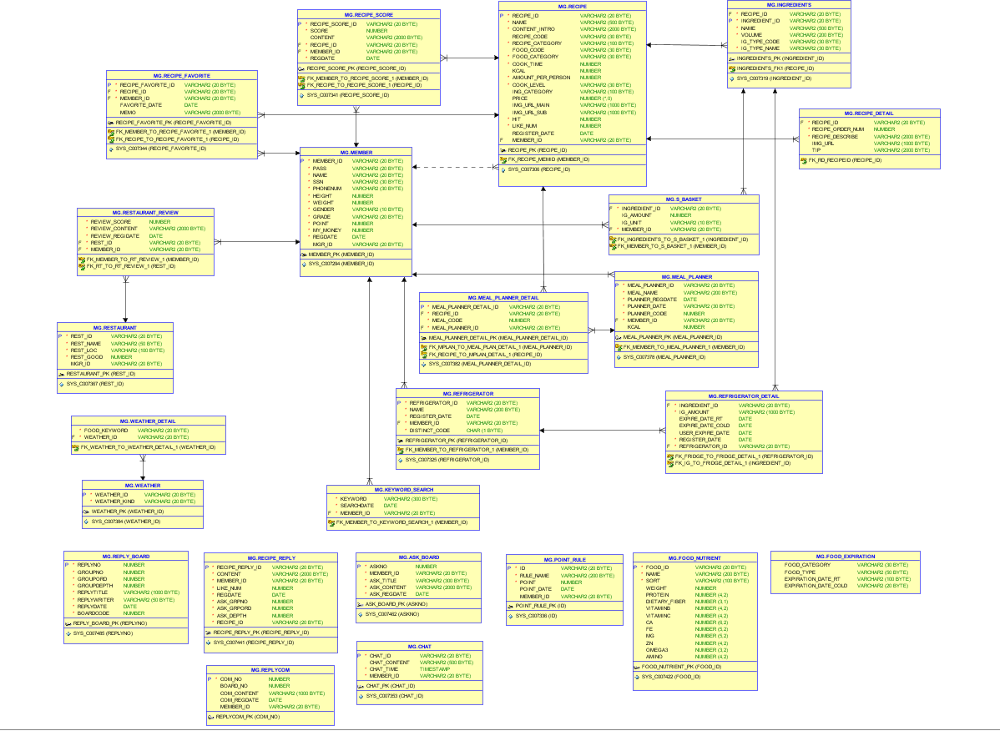

#### 내가 다룬 테이블

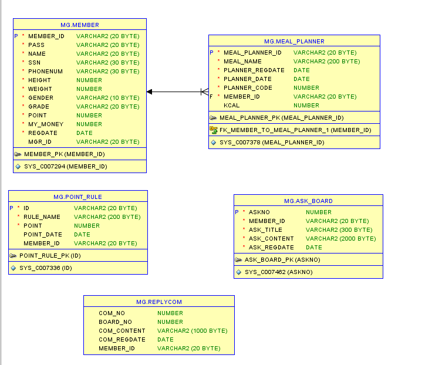

1. 식단

- 주간식단에 식단 추가하기
- mypage 식단관리 페이지에 주간식단 리스트 작성
- 로그인한 회원이 등록한 오늘 식단의 전체 칼로리를 합산 후 운동량 계산

2. 문의사항
   - 1:1 문의사항 글쓰기, 게시글 삭제, 게시글 상세보기, 게시글 수정, 댓글 등록

3. 회원
   - 로그인(세션유지+ 인터셉터), 회원정보수정(유효성 검사)

4. 포인트
   - 로그인한 회원의 포인트 정보 조회, 포인트 합산

5. 게시글 댓글
   - 모든 게시글의 댓글을 관리하는 테이블.

## 5번

#### 식단

- 식단 추가하기

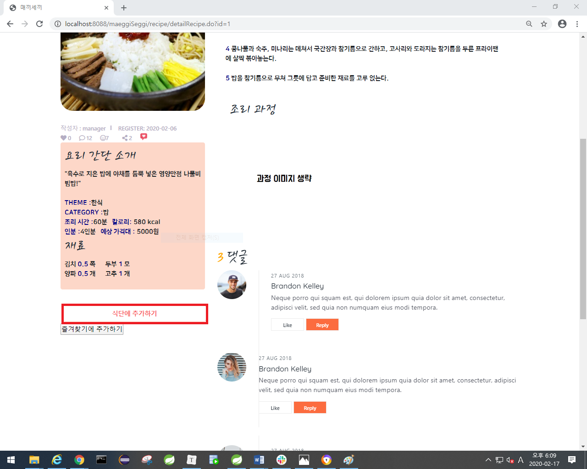

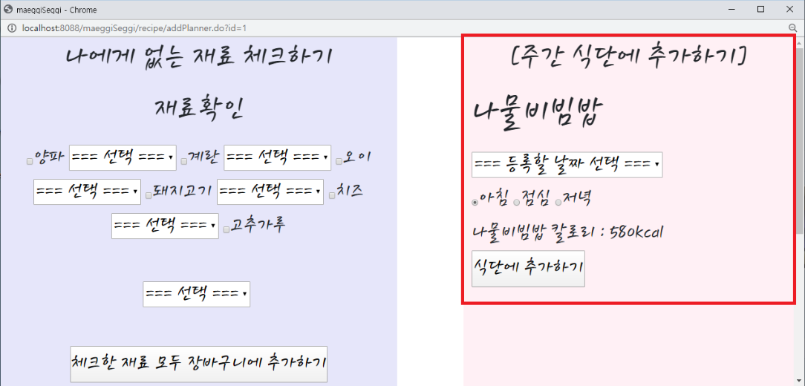

- 로그인 한 회원만 식단에 추가하기 기능을 사용할 수 있도록 로그인 세션 사용
- calendar클래스를 이용해서 오늘부터 7일간의 날짜를 select로 출력.
- 회원이 선택한 레시피의 id값으로 레시피 기본정보 테이블과 DB연동해서 select로 레시피 칼로리를 출력
-  식단에 추가하기
  - form태그와 submit을 이용해 Controller와 Post방식으로 연결.
  - input태그의 hidden타입으로 insert문 실행 시 meal_planner테이블에 넣을 컬럼값들을 넘김.
  - 식단에 추가하기 버튼을 누를 시 팝업창이 제거되도록 onclick속성에 window.close()메소드 사용.

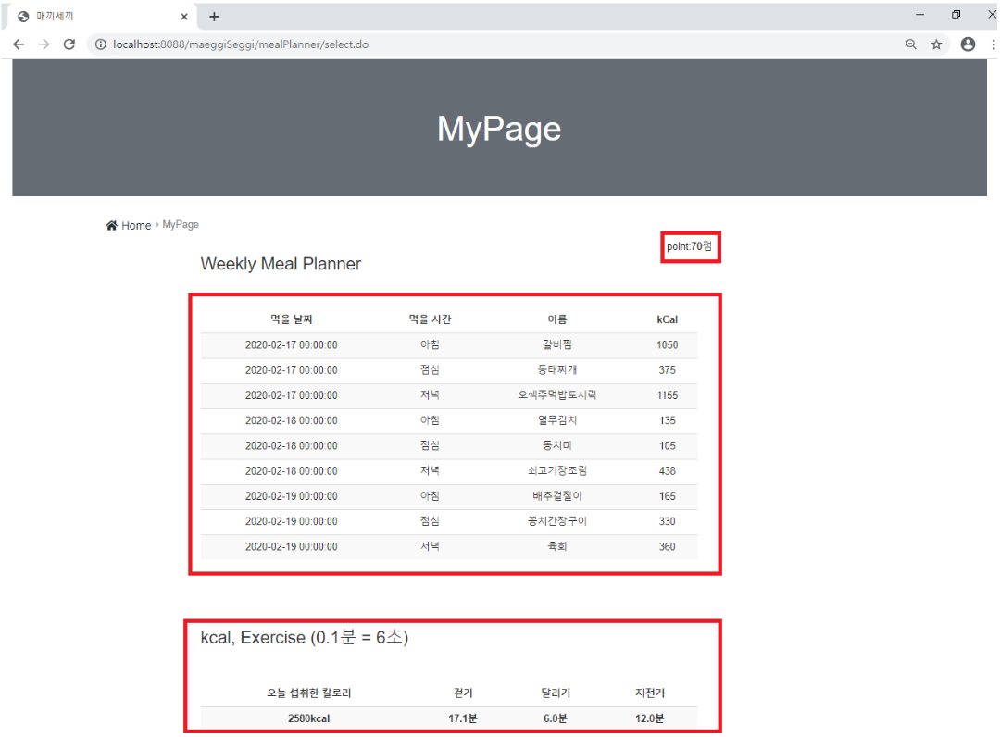

- mypage 식단관리 페이지에 식단 리스트 출력(DB연동)
- 회원의 포인트 합산을 select
- planner_date와 planner_code를 이용해서 select문으로 날짜순, 시간순으로 meal_planner테이블의 정보를 출력.
  - 날짜의 출력형식 때문에 sysdate를 쓸 수 없었음.
  - 그래서 오늘 날짜를 calendar클래스로 구한 후 세션에 등록했음. 그리고 컨트롤러를 통해 select문의 조건문에 넣어줌.
- 오늘 날짜부터 출력 되도록 설정.
  - 하루가 지나면 상단에 3개 record는 뷰에서 사라지게 됨.

- select와 group by로 로그인한 회원이 등록한 오늘 식단의 전체 칼로리를 합산 후 운동량 계산

  - 운동량은 신진대사 해당치(MET) 자료를 이용해 계산함.
  - 성별, 칼로리 계산 기준에따라 로그인 한 회원의 몸무게를 MET공식에 대입.

  - 걷기, 뛰기, 자전거타기를 몇분 운동해야 건강한 Kcal상태를 유지할 수 있는지 알려줌.

#### 1:1문의사항

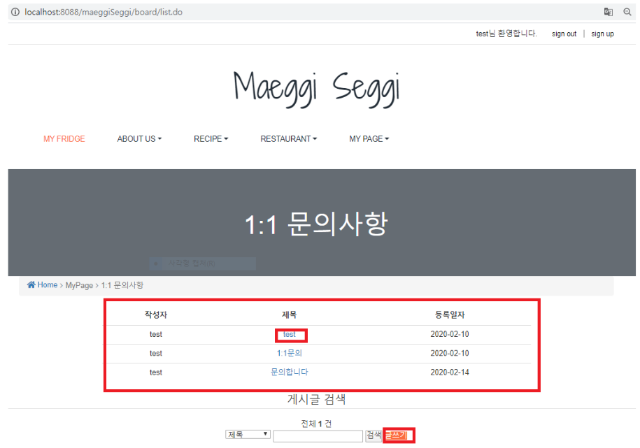

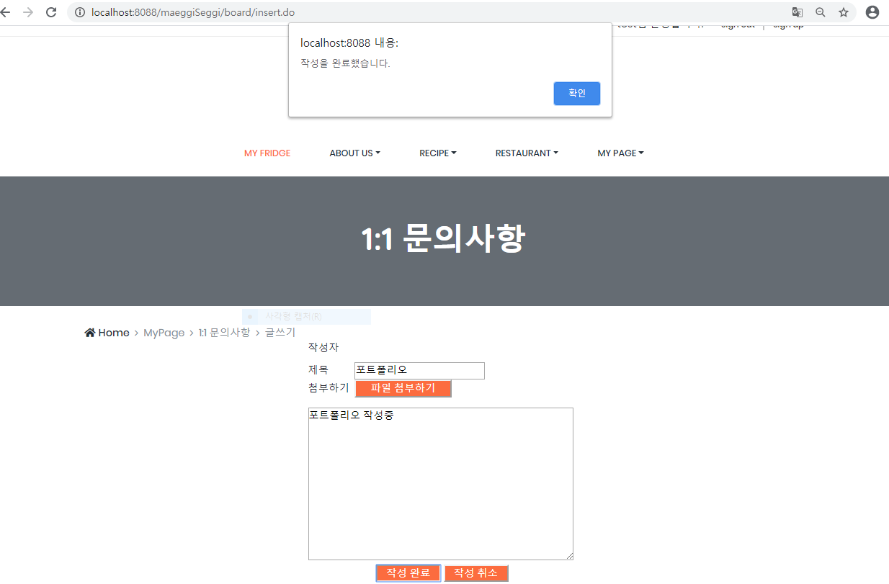

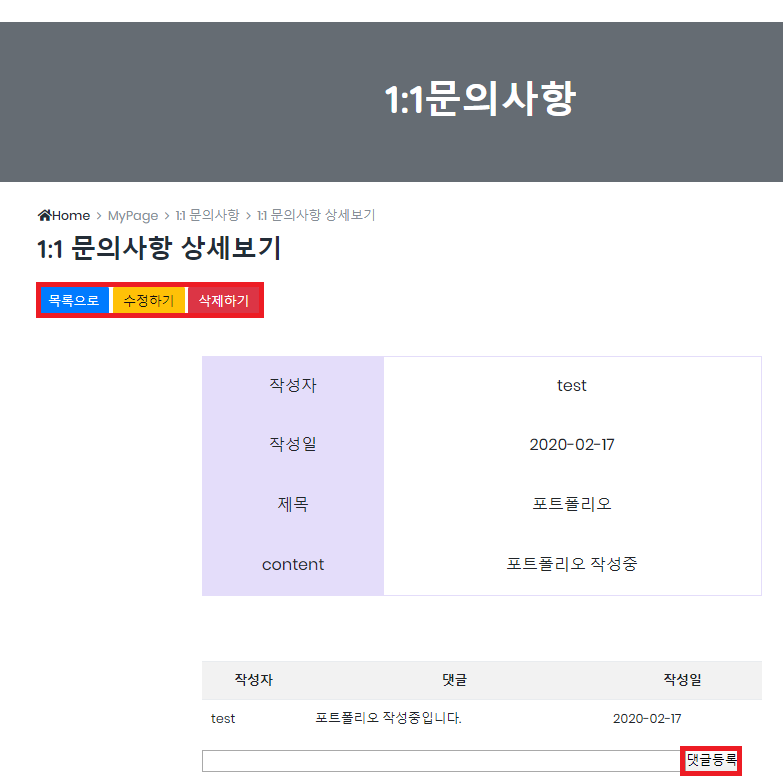

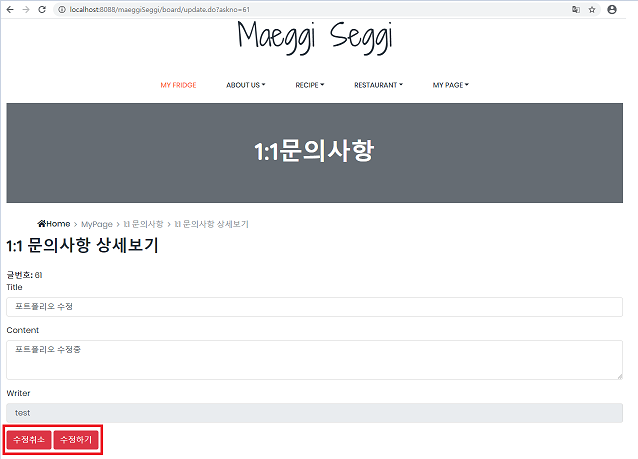

- 1:1 문의사항 글쓰기 

  - 작성 완료 클릭 시 alert로 출력 후 게시글 리스트 화면으로 redirect됨.
  - 작성 완료시 insert문으로 DB연동되어 작성한 글이 DB에 들어감. 

- 게시글 상세보기

  - 게시물의 제목을 클릭 시 DB연동해서 게시물에 대한 select문 실행.  

- 댓글 등록

  - 댓글 등록 클릭 시 세션에 등록된 로그인한 회원의 아이디, 댓글 내용, 작성날짜를 DB연동해서 댓글 테이블에 insert함. 

  - 댓글 등록 후 primary key인 게시글 번호를 통해서 redirect로 게시글 상세보기 화면을 유지함.  

- 댓글 출력

  - 등록된 댓글을 select 문으로 출력. 최신글이 아래에 오도록 오름차순 적용. 댓글 테이블에서 DB연동해서 정보 출력. 

- 게시글 삭제
  - 삭세하기 클릭 시 해당 페이지의 게시글 번호를 delete. DB연동으로 1:1문의사항 테이블에서 제거됨.
- 게시글 수정
  - 수정 취소 클릭 시 primary key인 게시글 번호에 맞게 게시글 상세보기 화면으로 전환됨.
  - 수정하기 클릭 시 게시글 번호를 조건으로 제목과 내용을 수정하는 update문 실행 후 전체  게시글 화면으로 전환됨. DB연동으로 1:1문의사항 테이블에서 정보가 수정됨

#### 회원관리

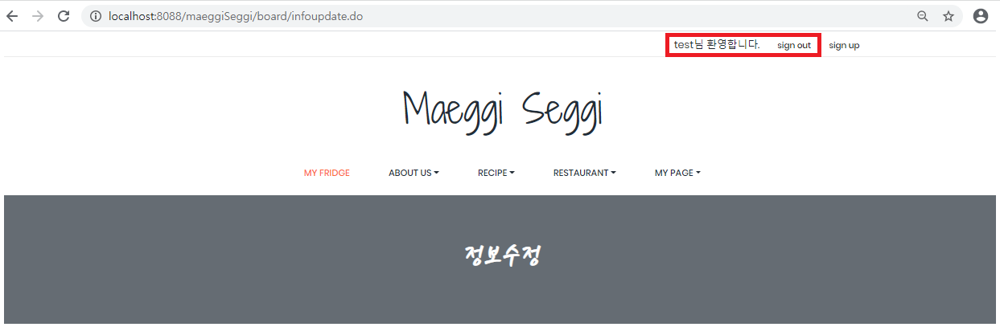

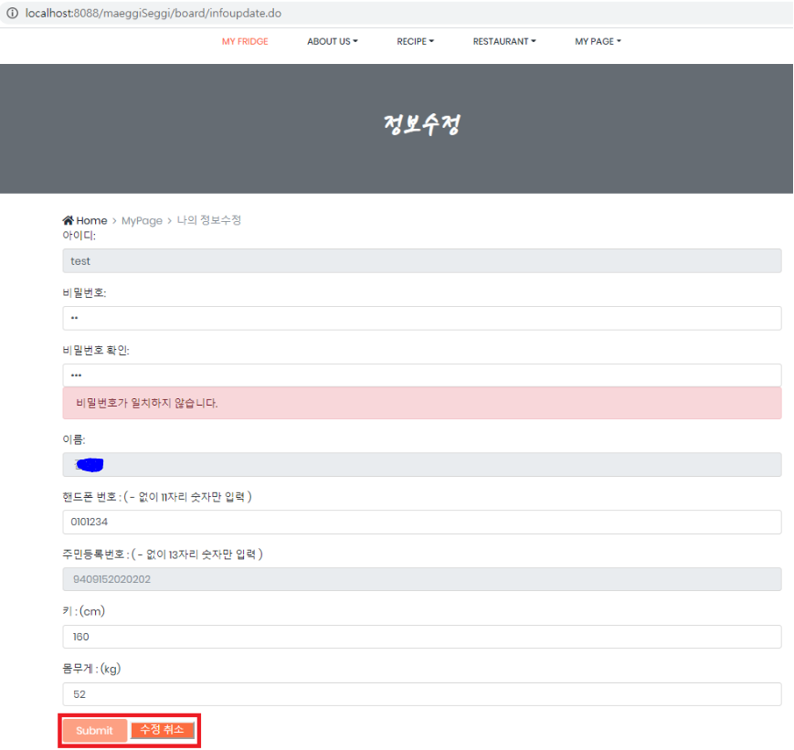

- 로그인
  - 로그인을 안했을 때 MY FRIDGE, MY PAGE, 식단에 추가하기 등 개인 정보를 이용해서 DB연동을 해야하는 페이지는 접근할 수 없도록 interceptor를 적용시킴.
  - 로그인 성공 시 로그인 한 회원의 아이디를 세션에 등록함. 이 아이디를 통해 회원정보가 필요한 페이지와 DB연동을 실시함. 

- 회원 정보 수정
  - 자바스크립트를 활용해서 비밀번호 일치, 핸드폰번호 글자수에 대한 유효성 검사 실시.
  - 유효성 검사를 통과하지 못할 시 회원수정 불가.
  - submit클릭 시 DB연동되어 해당 회원의 비밀번호, 핸드폰 번호, 키 , 몸무게 정보를 수정함.

#### 포인트

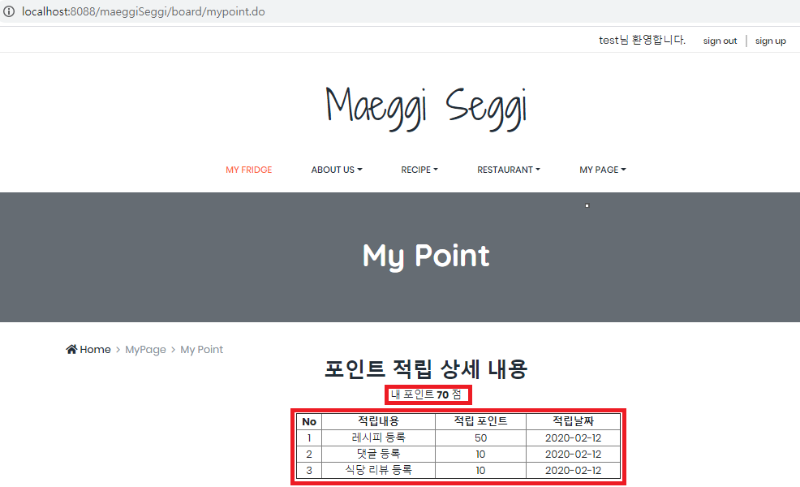

- DB연동해서 로그인 한 회원이 적립한 포인트 합산하는 select문 실행.
- DB연동해서 로그인 한 회원의 포인트 적립내용, 포인트, 적립날짜 select문 실행.

#### 관리자

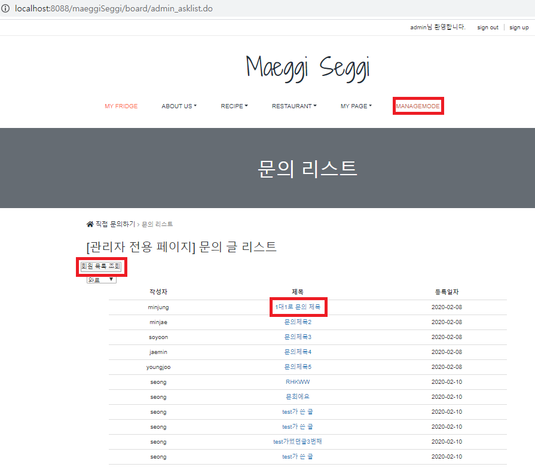

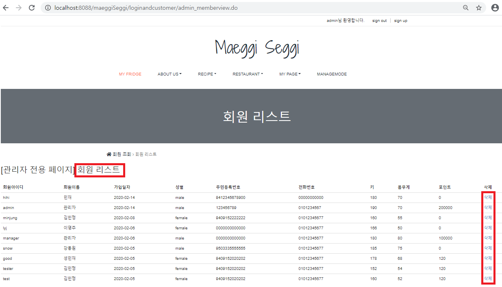

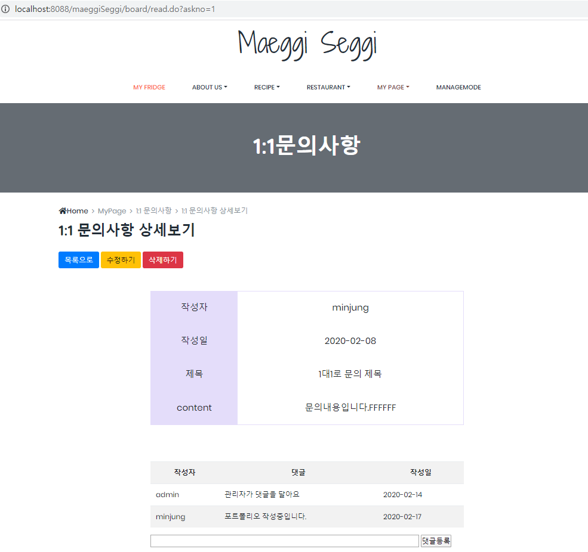

- JSTL을 사용하여 관리자 아이디로 로그인 시 상단 메뉴에 MANAGEMODE 생성. 
- MANAGEMODE클릭 시 DB연동해서 1:1 문의사항 테이블에 있는 전체 회원의 문의글을 select로 출력할 수 있다.
- 회원목록조회 클릭 시 DB연동해서 웹사이트에 회원가입된 모든 회원의 정보를 select 로 출력할 수 있다.
- 관리자로 로그인 했을때만 강제로 회원을 탈퇴시킬 수 있다. 삭제를 누를 시 회원의 정보가 DB에서 제거됨.
- 회원의 문의글 제목을 클릭 시 관리자와 회원이 공유하는 게시글 상세보기 페이지가 select된다.
  - 관리자 계정으로 로그인한 후 게시글에 댓글 등록 시 댓글 내용을 해당 게시글 회원과 공유할 수 있다.

## 4번

### 전체 프로젝트 구성

- maven 기반 Spring
  - src/main/java폴더에 mapper, controller, DAO, Service, VO를 모아놓고 웹사이트 개발. 

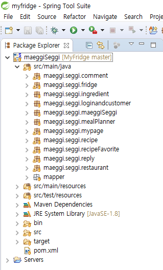

- 사용한 라이브러리들

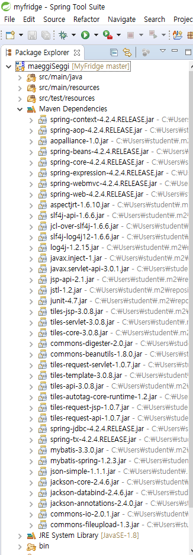

- src/main/webapp폴더에 오라클 DB연동, tiles, mybatis, interceptor, css, js, font, image, jsp파일을 작성한 뒤 개발.

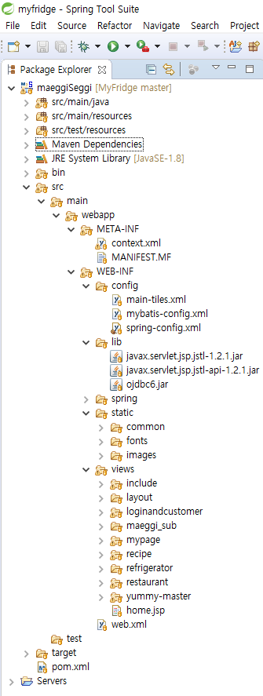

### Tiles

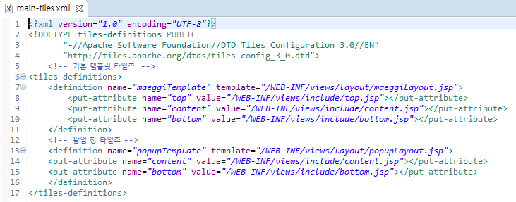

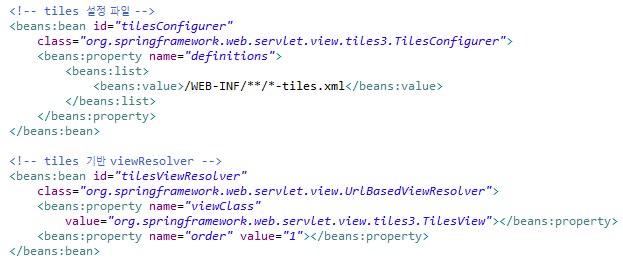

- 메인 tiles를 하나 정의한 뒤 모든 페이지에 동일한 TOP과 BOTTOM이 노출될 수 있도록 설계.
- 팀원들이 각자 구현하고자 하는 View에 따라 Content만 교체하는 방식으로 작업.

### Mybatis

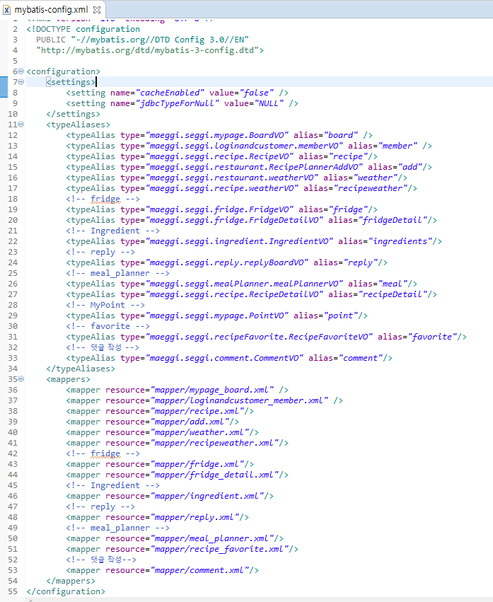

기능에 필요한 VO객체를 직접 정의한 뒤, VO객체의 패키지를 포함한 주소를 alias로 명칭을 부여하여 해당 객체 타입을 리턴할 때 alias를 통해 접근할 수 있도록 설계

mapper 패키지 안에 sql문이 실행될 수 있도록 작성한 xml파일을 찾을 수 있도록 작성

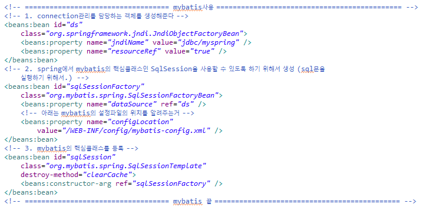

 mybatis를 사용하기 위해 설정파일 등록

### Interceptor

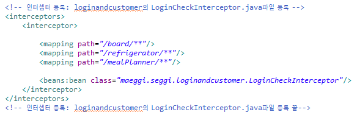

아이디 세션을 갖고 있는 경우에만 사용할 수 있는 페이지들에 대하여 Dispatcher 와 Controller 사이에 실행되는 Interceptor 기능의 prehandle 메소드를 사용. 컨트롤러가 실행되기 전 세션을 갖고있는지 여부를 체크하여 컨트롤러가 실행되어 화면에 진입할 수 있도록 함. 컨트롤러가 실행되기 전 작동하는 기능이므로, 도메인을 쳐서 직접 들어오는 상황 등을 방지할 수 있다.

### Library

- jstl라이브러리

- ojdbc6
- fileupload
- mybatis
- spring
- tiles