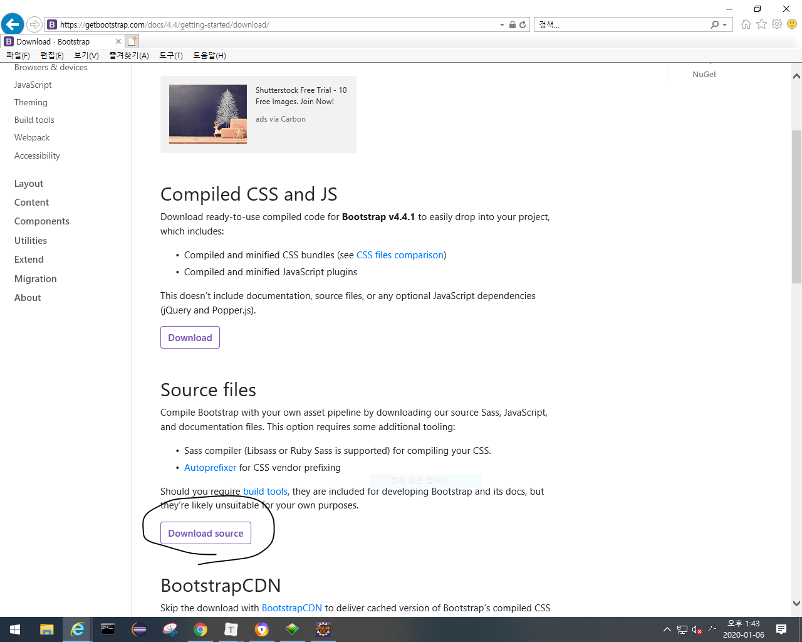
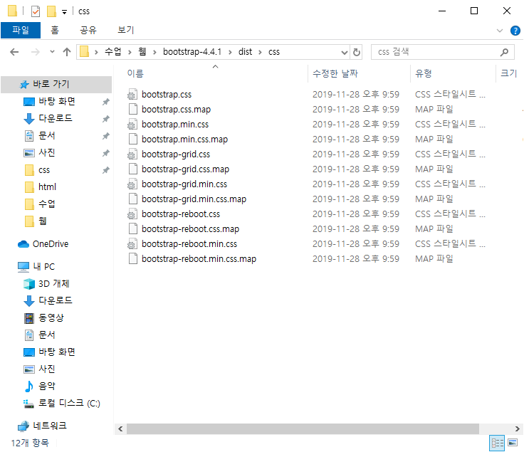
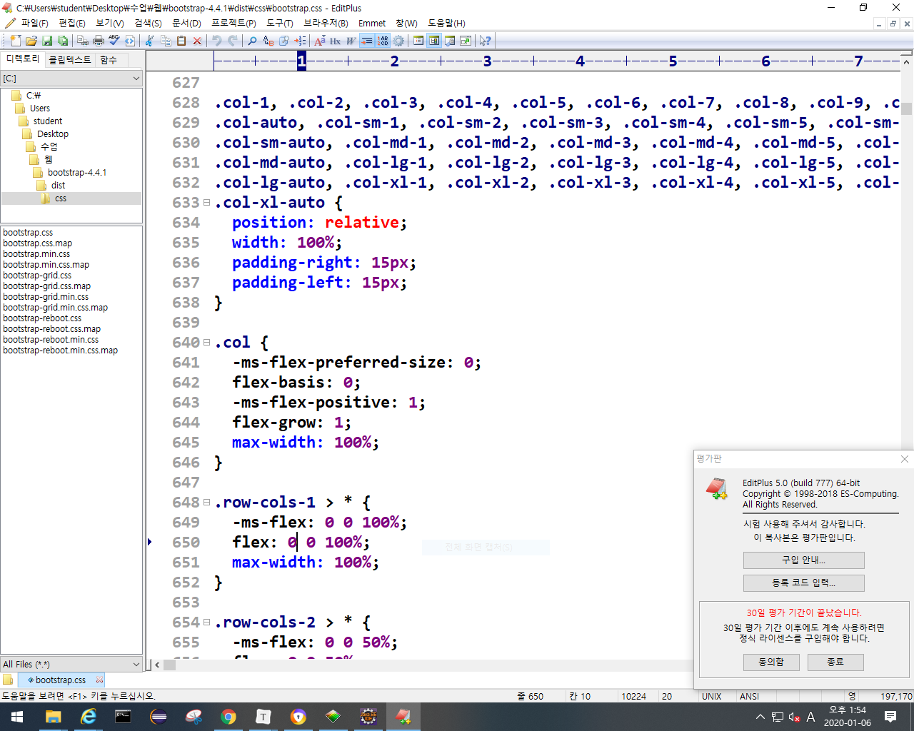
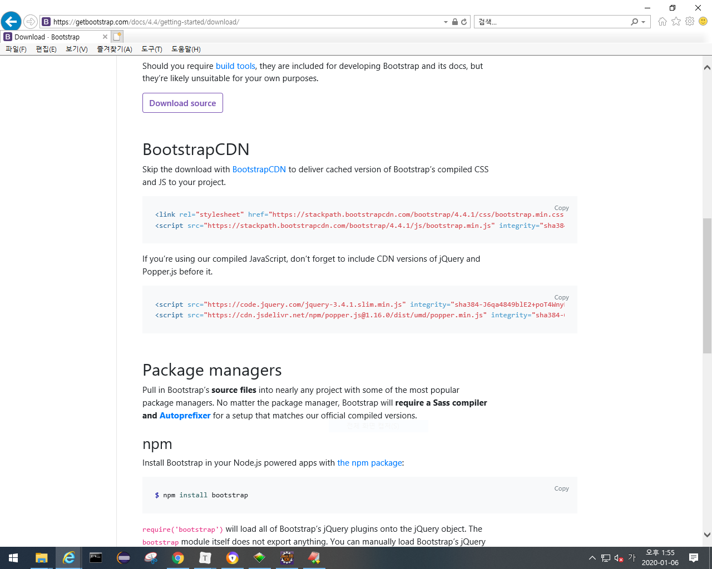

- 회원 가입시 우체국사이트에서 우편번호 API활용
- 웹상에서 채팅: 윕소켓의 기능을 쓰는게 제일 쉽다. 근데 채팅처럼 I/O가 많은 상황에서는 처리속도를      높이기 위해 nodeJS(비동기 통신)로 따로 구현하는게 좋다.
- 맵
  - 지도만 제공받을 수 있고 마커 찍기 등 기능들은 직접 구현해야함. (반경 몇 키로미터도 직접 구현?)
- 카카오페이 API로 현금을 포인트로 전환

- bootstrap(부트스트랩)
  - html + css + javascript를 프레임워크화 해놓은것.

  - 디자인 템플렛을 가져다 쓸 수 있음. 아래 동그라미 눌러서 다운로드 받기

    

  - 디자인이 나와야하는데 안나오는 이유의 대부분은 버전 충돌때문임 -> 버전충돌 조심

  - 아래꺼 절대 이클립스에서 열지 말기. 이클리스 다운됨

    

  - bootstrap.min.css를 쓰는게 처리속도가 빠름.

  - 맨위 bootstrap.css에 클래스, id, 태그 들을 style 한게 다 정의되어 있음. (아래그림) 

    

  - bootstrapCDN에서 사용하자.

    

## 프로젝트 발표

1. 주제선정
   - 동기
   
   - 시장분석
   
   - 패키지, usecase추출
   
   - 구상하는 기능을 기술로 표현할 수 있는지 검토하기
   
   - real data를 받을 수 있는지 검토하기
   
2. 스토리보드 작성
   
   - 대략적으로 화면을 어떻게 구성할지 정하는것. a4에 그리셈.

3. 테이블 설계
   - 엑셀로 테이블 구성
   - 각 테이블을 구성하는 컬럼과 컬럼 타입 정하기

4. view작성 - 이게 front end 구성하는 작업 
5. 스프링을 이용해서 back end 구성. (명절 전 주부터 들어감.)

- 2번, 3번은 순서 바껴도 되고 개별점검 하실거임.
- 4번까지가 중간발표

- 업무분석도 해야됨.