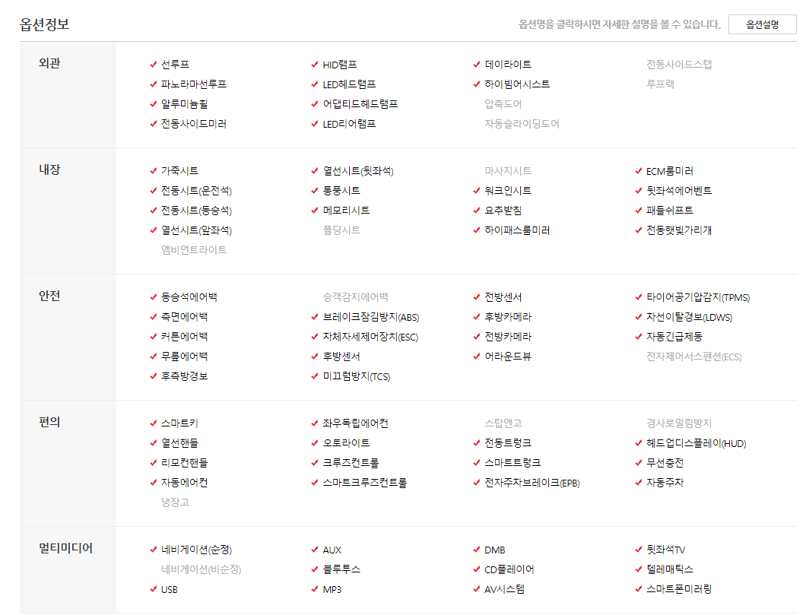

# RDBMS

- 회원
  
- 회원번호PK, ID, PW, 이름, 나이 ,폰번호, 주민번호, 성별, 회원가입 날짜
  
- 중고차

  - 자동차PK, 제조사, 모델, 세부모델, 적정가, 상한가, 하한가, 연식, 주행거리, 연료, 차량번호(?)

- 게시판(중고나라같이 자동차 판매글)

  - 게시글번호PK, 게시글제목, 게시글내용, 등록날짜, 조회수,댓글, 신고, 작성자FK(회원테이블), 자동차FK(중고차테이블)

  - 옵션들?(0 과 1만 가능하게 체크조건 걸기, 이거 중고차 테이블의 컬럼으로?)

    

- 문의사항 게시판

  - 게시글번호PK, 게시글제목, 게시글내용, 등록날짜, 작성자FK(회원테이블), 댓글

- 댓글
  
  - 댓글번호, 댓글내용, 댓글 작성날짜, 게시글번호FK(게시판테이블), 작성자FK(회원테이블)
- 사진
  
  - 사진번호, 사진, 등록날짜, 게시글번호, 회원번호FK(회원테이블)

- 1대1 채팅
  
  - 송신자, 수신자, 채팅내용, 채팅날짜

## 추가기능

게시글 올린사람이랑 채팅하기 (차살래 어플)

게시판 공유하기 버튼 (카톡공유)